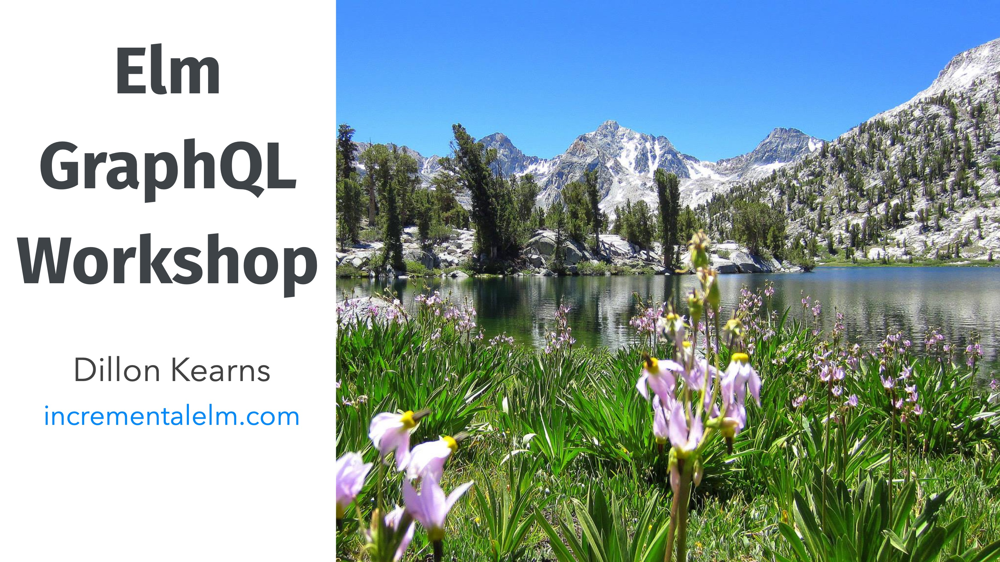
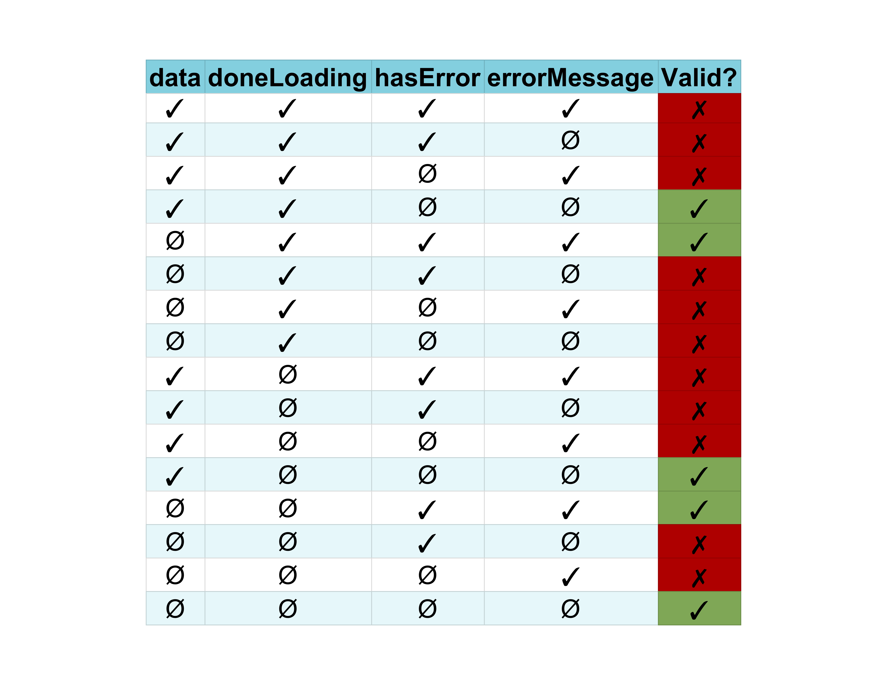

footer: incrementalelm.com
build-lists: true
slide-dividers: #

#

[.hide-footer]



# Query Context ✅

```haskell
query {

  viewer {
    company
  }
}
```

# Query Context 🚨🚔🚨 Violations

```haskell
query {
  company     # 💥⛔️💥
  viewer {
    company
  }
}
```

- Cannot query field "company" on type "Query"

# `elm-graphql` Query Context

```haskell
userSelection : SelectionSet (Maybe String) Github.Object.User
userSelection =
  Github.Object.User.company
```

- _Context_: `Github.Object.User`

# `elm-graphql` Query Context 💥⛔️💥

```haskell
query : SelectionSet (Maybe String) RootQuery
query =
  Query.repository
    {  login = "dillonkearns"
     , name = "elm-graphql" }
    Github.Object.User.company -- 💥⛔️💥
```

- _Context_: `Github.Object.Repository`
- _Context_: `Github.Object.User`

# -

```haskell
Github.Object.User.company  -- which place would it fit?
```

```haskell
repository : RepositoryRequiredArguments
    -> SelectionSet decodesTo Github.Object.Repository
    -> SelectionSet (Maybe decodesTo) RootQuery
```

```haskell
viewer : SelectionSet decodesTo Github.Object.User
    -> SelectionSet decodesTo RootQuery
```

# -

```haskell
Github.Object.User.company  -- which place would it fit?
```

```haskell
repository : SelectionSet decodesTo Github.Object.Repository
    -> SelectionSet (Maybe decodesTo) RootQuery
```

```haskell
viewer : SelectionSet decodesTo Github.Object.User
    -> SelectionSet decodesTo RootQuery
```

# GraphQL Errors

```haskell
type alias GraphqlError =
    { message : String
    , locations : Maybe (List Location)
    , details : Dict String Value
    }
```

# -

```haskell
errorToString : GraphqlError -> String
errorToString error =
    "locations:"
        ++ (error.locations
                |> locationsToString
           )
        ++ ", message: \n"
        ++ error.message


locationsToString : Maybe (List Location) -> String
locationsToString locations =
    locations
        |> Maybe.map (List.map (\location -> location |> Debug.toString))
        |> Maybe.map (\locationStrings -> String.join "\n" locationStrings)
        |> Maybe.withDefault ""
```

# Setup

github.com/IncrementalElm/elm-graphql-workshop

# Custom Scalars

- What is the purpose of a scalar?
  - `Date`
  - `DateTime`
  - `GitObjectID`
  - `HTML`
  - `URI`
  - `DateTime`: "An ISO-8601 encoded UTC date string."

# Custom Scalars Are Contracts

- Custom Scalar type wrappers by default
  - `type alias DateTime = DateTime String`
- Isn't that just a fancy `String`?
- Yup! Type-wise...
- Semantically, it's an ISO-8601 DateTime
- Contracts => Serializer/Deserializer

# Exercise 09 - Custom Scalars

```bash
./run.sh src/part09
```

# Exercise 10 - Imperfect Schemas

```bash
./run.sh src/part10
```

# [Polymorphism in GraphQL](http://elm-graphql.herokuapp.com)

```haskell
interface Character {
  id: ID!
  name: String!
  friends: [Character]
  appearsIn: [Episode]!
}
```

```haskell
type Human implements Character {
  id: ID!
  name: String!
  friends: [Character!]!
  homePlanet: String!
}

type Droid implements Character {
  id: ID!
  name: String!
  friends: [Character!]!
  primaryFunction: String!
}
```

# Polymorphism in Elm GraphQL

```elm
type alias HumanOrDroidWithName =
    { name : String
    , details : HumanOrDroidDetails
    }

heroSelection : SelectionSet HumanOrDroidWithName Swapi.Interface.Character
heroSelection =
    SelectionSet.map2 HumanOrDroidWithName
        Character.name
        (Character.fragments
            { onHuman = SelectionSet.map HumanDetails Human.homePlanet
            , onDroid = SelectionSet.map DroidDetails Droid.primaryFunction
            }
```

^ Unlike GraphQL, you can guarantee an exhaustive fragment

# Non-Exhaustive Fragments

```elm
nonExhaustiveFragment : SelectionSet (Maybe String) Swapi.Union.CharacterUnion
nonExhaustiveFragment =
    let
        maybeFragments =
            Swapi.Union.CharacterUnion.maybeFragments
    in
    Swapi.Union.CharacterUnion.fragments
        { maybeFragments
            | onHuman = Human.homePlanet
        }
```

# Unions

- Exactly like fragments, except there are no common fields.

# Unions in Elm GraphQL

```elm
type HumanOrDroidDetails
    = HumanDetails (Maybe String)
    | DroidDetails (Maybe String)

heroUnionSelection : SelectionSet HumanOrDroidDetails Swapi.Union.CharacterUnion
heroUnionSelection =
    Swapi.Union.CharacterUnion.fragments
        { onHuman = SelectionSet.map HumanDetails Human.homePlanet
        , onDroid = SelectionSet.map DroidDetails Droid.primaryFunction
        }
```

# Up-To-Date Generated Code

- Simple CI check
- `npm run regenerate-elm-graphql && elm make ...`
- Every time before your schema goes live
- Otherwise, exhaustive checks could fail

# Data Modeling Example

JavaScript

```javascript
{
    hasError: true,
    errorMessage : 'Error message from server',
    doneLoading: true,
    data: null
}
```

---



---

# RemoteData

```elm
type RemoteData data
    = NotAsked
    | Loading
    | Failure Http.Error
    | Success data
```

# Subscriptions

# Exercise 12 Tying It All Together

- Schema Stitching

```bash
./run.sh src/part12
```

# Feedback

- Anonymous Survey
  - [tiny.cc/elm-graphql-feedback](http://tiny.cc/elm-graphql-feedback)

# -


# -

```

```
